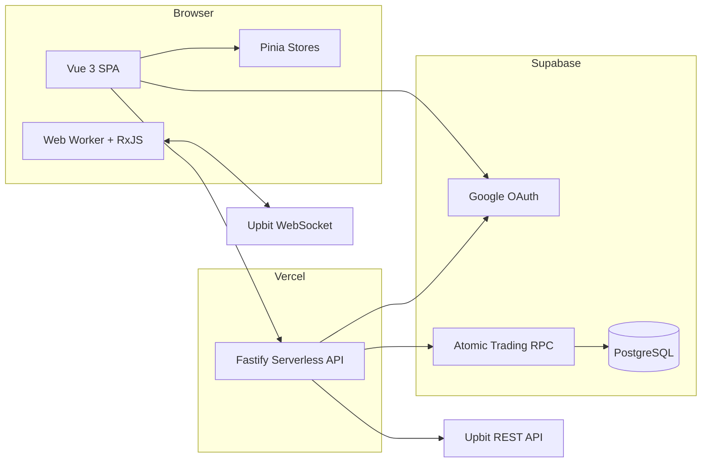

<p align="center">
  <sub>REAL-TIME CRYPTO MARKET · PAPER TRADING</sub>
</p>

<h1 align="center">CoinBurrow</h1>

<p align="center">
  <strong>시장의 흐름을 깊게 파고들고, 실제 돈 없이 판단을 검증하세요.</strong>
</p>

<p align="center">
  실시간 시장 데이터, 시장 동향, 모의 주문, 포트폴리오를 하나의 흐름으로 연결한 크립토 대시보드
</p>

<p align="center">
  <a href="https://coinburrow.vercel.app">
    
  </a>
  
  
</p>

<p align="center">
  <a href="https://coinburrow.vercel.app"><strong>라이브 데모</strong></a>
  ·
  <a href="#완성된-mvp">완성된 MVP</a>
  ·
  <a href="#사용-흐름">사용 흐름</a>
  ·
  <a href="#mvp-이후">MVP 이후</a>
</p>

---

## CoinBurrow란?

CoinBurrow는 **실시간 크립토 시장을 분석하고 곧바로 모의 거래까지 이어갈 수 있는 웹 앱**입니다. Upbit 공개 데이터를 기반으로 가격, 캔들, 호가, 체결 내역을 보여주며 Google 로그인 시 `100,000,000 KRW` 모의 계좌를 자동으로 생성합니다.

별도의 모의 투자 페이지로 이동할 필요가 없습니다. 거래소에서 시장을 보던 흐름 그대로 BTC 또는 ETH를 매수·매도하고, 차트의 매수가 라벨과 마이페이지의 통합 손익으로 판단 결과를 확인합니다.

> CoinBurrow는 실제 거래소 계좌나 자산에 연결되지 않습니다. 모든 주문은 서비스 내부의 모의 계좌에서만 체결됩니다.

## 완성된 MVP

| 실시간 거래소 | 모의 주문 |
| --- | --- |
| Upbit 기반 실시간 시세, 캔들, 호가, 체결 데이터 | 호가 패널 바로 옆에서 BTC·ETH 시장가 매수와 매도 |
| Web Worker와 RxJS로 고빈도 스트림 처리 | 가격·수량·총액 입력, 비율 선택, 슬라이더와 증감 제어 |
| 선택 종목에 맞춰 차트와 시장 정보 동기화 | 체결 후 차트에 평균 매수가 라벨 표시 |

| 시장 동향 | 개인 모의 계좌 |
| --- | --- |
| 글로벌 시장, 투자 심리, 김치 프리미엄을 한 페이지에서 확인 | 현금, 보유 수량, 평가액, 총자산, 통합 손익과 수익률 제공 |
| 공개 데이터 실패 시에도 가능한 범위까지 정보 제공 | 최초 가입 3단계 가이드와 언제든 가능한 계좌 초기화 |
| 로그인 없이도 시장 데이터 탐색 가능 | 사용자별 Supabase 계좌·포지션·주문 원장 분리 |

### 주요 화면

| 경로 | 역할 |
| --- | --- |
| `/` | CoinBurrow 소개와 주요 기능 진입 |
| `/exchange` | 실시간 시장 분석과 BTC·ETH 모의 주문 |
| `/insights` | 글로벌 시장, 투자 심리, 김치 프리미엄 |
| `/mypage` | 총자산, 통합 손익, 보유 종목과 계좌 초기화 |

## 사용 흐름

1. 어느 페이지에서든 Google 계정으로 로그인합니다.
2. 첫 가입이라면 3단계 웰컴 가이드를 확인하고 `100,000,000 KRW` 모의 계좌를 받습니다.
3. 거래소에서 BTC 또는 ETH를 선택하고 시장·호가·차트를 분석합니다.
4. 가격, 주문 수량, 주문 총액을 조절해 시장가 주문을 실행합니다.
5. 체결된 평균 매수가는 차트의 `매수가` 라벨로 즉시 표시됩니다.
6. 마이페이지에서 현금, 보유 자산, 총자산과 통합 수익률을 확인합니다.

```text
Google 로그인 → 모의 계좌 생성 → 시장 분석 → 모의 주문 → 차트 매수가 확인 → 마이페이지 손익 확인
```

## MVP 거래 규칙

| 항목 | 현재 규칙 |
| --- | --- |
| 초기 자금 | `100,000,000 KRW` |
| 지원 종목 | `BTC`, `ETH` |
| 주문 방식 | 시장가, 즉시 전량 체결 |
| 매수 제한 | 계좌 초기화 전까지 종목별 1회 |
| 매도 | 보유 수량 범위에서 부분·전량 매도 가능 |
| 수수료·슬리피지 | MVP에서는 각각 `0%` |
| 체결 가격 | 주문 시점의 서버 조회 Upbit 현재가 |
| 계좌 초기화 | 현금, 포지션, 주문 이력을 초기 상태로 복원 |

매수 제한은 현재 보유 여부가 아니라 **계좌 초기화 이후의 매수 이력**을 기준으로 합니다. 따라서 전량 매도 후에도 같은 종목을 다시 매수할 수 없으며, 계좌를 초기화하면 BTC와 ETH를 각각 다시 한 번 매수할 수 있습니다.

<p align="center">
  <a href="https://coinburrow.vercel.app/exchange"><strong>거래소에서 모의 투자 시작하기</strong></a>
</p>

---

## MVP 이후

아래 항목은 완성된 MVP와 분리해 관리하는 후속 범위입니다. 현재의 단순한 거래 규칙과 안정적인 핵심 흐름을 유지한 뒤 우선순위에 따라 확장합니다.

| 영역 | 후속 작업 후보 |
| --- | --- |
| 거래 정교화 | 복수 매수와 가중 평균단가, 지정가 주문, 부분 체결, 수수료·슬리피지 모델 |
| 성과 분석 | 주문 히스토리, 실현·미실현 손익 분리, 일간·주간 성과 스냅샷 |
| 자산 확장 | 지원 종목 확대, 종목별 리스크 지표와 비교 기능 |
| 학습 경험 | 이벤트 시나리오, 미션, 투자 회고와 판단 기록 |
| 제품 확장 | 모바일 경험, 알림, 멀티 사용자 기능과 선택적 리더보드 |
| 운영 안정화 | 실제 OAuth·주문 E2E 자동화, 관측성 강화, 프론트엔드 번들 분할 |

## 개발자 안내

### 기술 스택

| 영역 | 기술 |
| --- | --- |
| Frontend | Vue 3, Vite, TypeScript, Pinia, Vue Router |
| Realtime | Web Worker, Native WebSocket, RxJS, Zod |
| Chart | Lightweight Charts, Highcharts |
| Motion / Visual | GSAP, Spline Runtime |
| Backend | Fastify 5, TypeScript, undici, Zod |
| Auth / Database | Supabase Auth, PostgreSQL, SQL RPC |
| Test | Vitest, Vue Test Utils, vue-tsc |
| Runtime / Deploy | Docker Compose, Nginx, Vercel Functions |

### 아키텍처



- 실시간 ticker·orderbook·trade·candle 스트림은 브라우저 Worker가 Upbit WebSocket에 직접 연결해 처리합니다.
- Fastify는 REST 시장 데이터 정규화, JWT 검증, 서버 체결가 조회와 모의 계좌 API를 담당합니다.
- 주문은 PostgreSQL RPC 안에서 계좌 row를 잠그고 계좌·포지션·주문 원장을 하나의 트랜잭션으로 변경합니다.
- 클라이언트는 예상 가격을 표시하지만 최종 체결 가격과 잔고 검증은 항상 서버가 결정합니다.

### 환경 변수

웹 환경 파일을 `web/.env.local`에 구성합니다.

```dotenv
VITE_SUPABASE_URL=https://YOUR_PROJECT.supabase.co
VITE_SUPABASE_PUBLISHABLE_KEY=YOUR_PUBLISHABLE_KEY

# Legacy Supabase 프로젝트는 아래 키도 지원합니다.
# VITE_SUPABASE_ANON_KEY=YOUR_ANON_KEY
```

서버 환경 파일을 `server/.env`에 구성합니다.

```dotenv
PORT=4000
SUPABASE_URL=https://YOUR_PROJECT.supabase.co
SUPABASE_SECRET_KEY=YOUR_SERVER_SECRET_KEY

# DB migration을 실행할 때 필요합니다.
POSTGRES_URL_NON_POOLING=YOUR_DIRECT_POSTGRES_URL
```

> `SUPABASE_SECRET_KEY`와 PostgreSQL 연결 문자열을 `VITE_` 환경 변수에 넣거나 Git에 커밋하지 마세요. `VITE_` 변수는 브라우저 번들에 노출됩니다.

### Docker로 실행

개발 환경은 frontend와 backend를 함께 실행하며 소스 변경을 HMR로 반영합니다.

```bash
docker compose up --build
```

| 서비스 | 주소 |
| --- | --- |
| Web | `http://localhost:3000` |
| API health | `http://localhost:4000/health` |

프로덕션 이미지와 Nginx 프록시를 로컬에서 확인하려면 다음 구성을 사용합니다.

```bash
docker compose -f compose.prod.yml up --build
```

### 로컬에서 실행

Node.js 22와 npm이 필요합니다.

```bash
npm ci

# Terminal 1
npm run dev --workspace server

# Terminal 2
npm run dev --workspace web
```

### 데이터베이스 마이그레이션

`server/.env`에 direct PostgreSQL URL을 설정한 뒤 SQL migration을 이름순으로 적용합니다.

```bash
npm run db:migrate:simulator --workspace server
```

주요 migration은 `supabase/migrations`에서 관리합니다.

### 테스트와 빌드

```bash
# server 137 + web 119 = 256 tests
npm test

# server TypeScript + web vue-tsc/Vite production build
npm run build
```

현재 MVP 기준 전체 `47`개 테스트 파일의 `256`개 테스트가 통과합니다.

### 프로젝트 구조

```text
CoinBurrow/
├─ api/                    # Vercel 고정 function entry
├─ server/
│  ├─ scripts/             # Supabase migration runner
│  ├─ src/routes/          # 시장·시뮬레이터 API
│  └─ src/simulator/       # 인증, 서비스, repository, quote provider
├─ supabase/migrations/    # 계좌·포지션·주문 RPC schema
├─ web/
│  ├─ src/features/        # landing, exchange, insights, simulator
│  ├─ src/stores/          # auth, market, simulator state
│  └─ src/workers/         # Upbit realtime stream workers
├─ compose.yml             # 개발 HMR 환경
└─ compose.prod.yml        # production image 환경
```

### 배포와 기록

- Production: [coinburrow.vercel.app](https://coinburrow.vercel.app)
- MVP 기획·구현·회귀: [MVP 단일 사용자 모의 투자 시뮬레이터](./MVP-%EB%8B%A8%EC%9D%BC-%EC%82%AC%EC%9A%A9%EC%9E%90-%EB%AA%A8%EC%9D%98-%ED%88%AC%EC%9E%90-%EC%8B%9C%EB%AE%AC%EB%A0%88%EC%9D%B4%ED%84%B0-%EC%95%84%EC%9D%B4%EB%94%94%EC%96%B4.md)
- [#14 스택 마이그레이션](https://github.com/HappyMarmot123/CoinBurrow/issues/14)
- [#15 Vercel API 배포 오류 회고](https://github.com/HappyMarmot123/CoinBurrow/issues/15)
- [#18 Web Worker와 RxJS 파이프라인](https://github.com/HappyMarmot123/CoinBurrow/issues/18)

---

<p align="center">
  <strong>CoinBurrow</strong><br />
  실제 자산 없이 시장을 읽고, 주문하고, 결과를 확인합니다.
</p>
